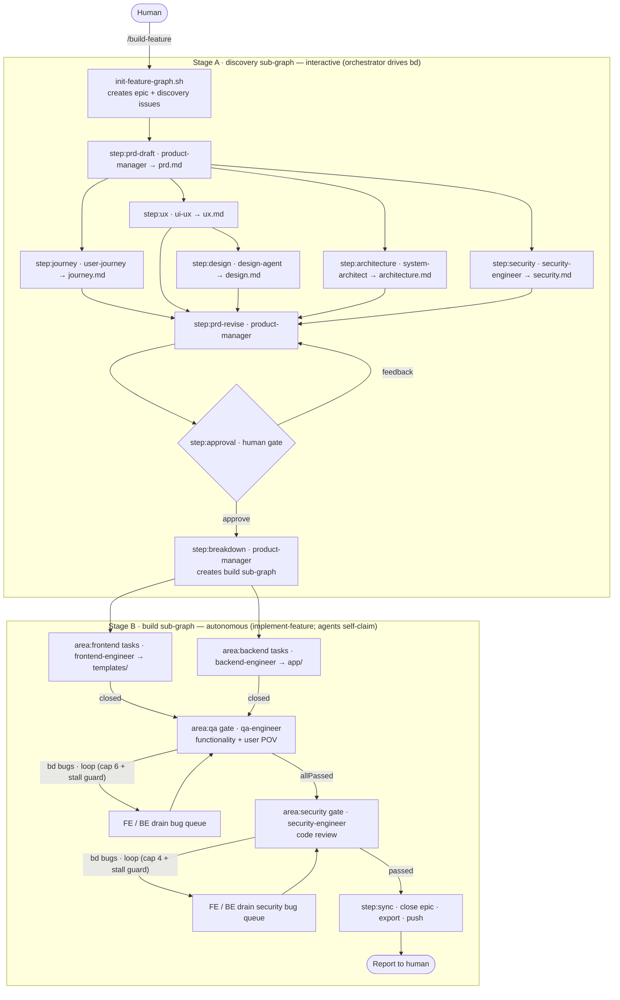

# HookBox agent workflow

A multi-agent pipeline that turns a one-line feature request into reviewed,
implemented, QA'd, and security-reviewed code. Nine specialized agents
collaborate in two stages — an **interactive, human-gated PRD stage** then an
**autonomous build stage** — and
**the entire workflow is one [beads](https://github.com/gastownhall/beads) (`bd`)
graph**: every agent step is a tracked issue, dependencies encode the order, and
the whole thing is visible in `bd dep tree <epic>`.

- **Single entry point:** `/build-feature "<request>"` (`.claude/commands/build-feature.md`)
- **Graph bootstrap:** `.claude/scripts/init-feature-graph.sh` (creates the discovery sub-graph)
- **Autonomous build:** `implement-feature` workflow (`.claude/workflows/implement-feature.js`)
- **Artifacts:** `docs/features/<slug>/` (PRD + critiques + design) — see
  [`docs/features/README.md`](../../docs/features/README.md).

## How the agents coordinate

Four facts shape the design:

1. **Subagents can't call subagents.** A single orchestrator (the `/build-feature`
   command in Stage A, the `implement-feature` workflow in Stage B) invokes every
   agent. Agents never call each other directly.
2. **Isolated context.** Each agent runs in its own context window with no shared
   chat. Coordination happens through the **PRD/design docs** and the **bd graph**.
3. **Frozen contract + lane ownership.** The system-architect's *§5 frozen
   interface contract* lets frontend and backend code against one spec without
   talking; disjoint file lanes (`templates/` vs `app/`) keep parallel edits safe.
4. **bd issue ownership.** The orchestrator owns the lifecycle of the *discovery*
   issues (it claims → runs the single-shot agent → closes). Stage B agents own
   their *build* issues directly, because they drain a queue of many in one run.

## The bd label scheme

| Label | Meaning |
|-------|---------|
| `feature:<slug>` | every issue belonging to one feature (epic + all children) |
| `phase:discovery` | Stage A steps |
| `step:<name>` | a unique discovery/sync step: `prd-draft`, `journey`, `ux`, `design`, `architecture`, `security`, `prd-revise`, `approval`, `breakdown`, `sync` |
| `agent:<name>` | which agent owns a discovery step |
| `area:<lane>` | Stage B lane: `frontend`, `backend`, `qa`, `security`, `sync` |

Claim by label, e.g. `bd ready -l step:journey,feature:<slug> --claim` or
`bd ready -l area:frontend,feature:<slug> --claim`.

## The cast

| Agent | Stage | Reads | Writes | Lane / tools | Model |
|-------|-------|-------|--------|--------------|-------|
| `product-manager` | A | feature request, `journey.md`, `ux.md`, `architecture.md`, `security.md`, human feedback | `prd.md` + the **bd build sub-graph** (tasks, QA gate, security gate, sync) | no code · Read/Write/Edit/Grep/Glob/Bash | opus |
| `user-journey` | A | draft `prd.md`, templates/routes | `journey.md` | read-only on source · Read/Write/Grep/Glob | opus |
| `ui-ux` | A | draft `prd.md`, templates | `ux.md` | read-only on source · Read/Write/Grep/Glob | opus |
| `design-agent` | A | `ux.md`, draft `prd.md`, templates (`base.html`) | `design.md` (visual/aesthetic layer on top of `ux.md`) | read-only on source · Read/Write/Grep/Glob | opus |
| `system-architect` | A | draft `prd.md`, `journey.md`, `ux.md`, codebase | `architecture.md` (design + authoritative §5) | read-only on source · Read/Write/Grep/Glob/Bash | opus |
| `frontend-engineer` | B | `prd.md` §5, `architecture.md` + claimed `area:frontend` issues | `templates/` + static; closes its issues | frontend lane · +Bash | inherit |
| `backend-engineer` | B | `prd.md` §5, `architecture.md` + claimed `area:backend` issues | `app/`, `config.py`, `requirements.txt`; closes its issues | backend lane · +Bash | inherit |
| `qa-engineer` | B | `prd.md` §4/§5, `architecture.md`, `journey.md`, code | `qa-report.md`; files defects as `bd` bugs | reports only · +Bash | opus |
| `security-engineer` | A · B | A: draft `prd.md`, `architecture.md`, codebase · B: `prd.md` §5, `security.md`, the implemented code | A: `security.md` (threats + required security ACs / §5 notes) · B: `security-report.md`; files defects as `bd` bugs | read-only on source · Read/Grep/Glob/Bash | opus |

## Flow — one bd graph



### Stage A — discovery (interactive)

The orchestrator is `/build-feature` running in your conversation; the human is
the final gate. After bootstrapping, it walks the discovery issues in dependency
order — claim → run agent → close — so `bd ready -l feature:<slug>` always shows
what's next:

1. **bootstrap** — `init-feature-graph.sh <slug> "<title>"` creates the epic +
   discovery issues.
2. **prd-draft** — `product-manager` writes `prd.md`, grounded in the codebase
   (every file/route/field tagged *existing-verified* or *new*).
3. **journey ∥ ux ∥ architecture ∥ security** (unblocked once the draft closes) —
   `user-journey` → `journey.md`, `ui-ux` → `ux.md`, `system-architect` →
   `architecture.md` (the technical design + authoritative §5 contract),
   `security-engineer` (DESIGN) → `security.md` (threat model + required security
   ACs / §5 notes).
4. **design** (unblocked once `ux` closes — the handoff) — `design-agent` reads
   `ux.md` + the templates and writes `design.md`: the visual/aesthetic layer
   (design tokens, component styling, visual states, motion) built on top of the
   UX. Runs concurrently with any still-finishing architecture/security work.
5. **prd-revise** — `product-manager` folds the critiques + `design.md` +
   architecture + security into `prd.md`, lifting §5 verbatim, adding the required
   security ACs, and turning design.md's testable visual choices into ACs.
6. **approval** (human gate) — you review goal, ACs (§4), §5, and Open Questions
   (§9); feedback re-runs revise; the gate can't close while §9 is non-empty.
7. **breakdown** — on approval, `product-manager` resolves the epic and builds
   the build sub-graph (task issues + QA gate + sync issue, wired with deps).
   The PRD is frozen.

### Stage B — build (autonomous)

The orchestrator is the `implement-feature` workflow; Stage B agents self-claim.

1. **Implement (parallel)** — `frontend-engineer` and `backend-engineer` each
   loop `bd ready -l area:<lane>,feature:<slug> --claim` → implement to the frozen
   contract + `architecture.md` → `bd close`, until their lane is empty. Atomic
   claim + hash IDs + disjoint lanes = no collisions.
2. **QA (two lenses)** — the QA gate unblocks when all tasks close. `qa-engineer`
   validates **functionality POV** (every AC + the FE↔BE contract, with evidence)
   *and* **user POV** (walks every flow in `journey.md` against the running app),
   then writes `qa-report.md`.
3. **Fix loop** — defects become `bd` bug issues in the owning lane and re-block
   the QA gate; engineers drain them and QA re-runs. **Loops until both lenses
   pass**, capped at 6 rounds with a stall guard (stops after 2 no-progress rounds).
4. **Security gate** — once QA passes, the security gate unblocks. `security-engineer`
   (REVIEW) reviews the implemented code against §5 + the `security.md` threats
   (authz/IDOR, injection, SSRF, secrets, CSRF, WebSocket auth, DoS), files defects
   as `bd` bugs in the owning lane, and re-blocks the gate; engineers drain them and
   security re-runs. **Loops until clean**, capped at 4 rounds with the same stall
   guard. (Skipped if QA never fully passed — the gate stays blocked behind it.)
5. **Sync** — once the security gate passes, `bd export` reconciles the JSONL, the
   epic + sync issue close, and `bd dolt push` runs if a remote exists.

## Beads operations (gotchas worth knowing)

- **Auto-commit is ON** (`.beads/config.yaml` → `dolt.auto-commit: on`). Beads
  defaults it *off*, so writes hit Dolt's working set but aren't committed — across
  separate agent processes work then appears to "revert." Keep it on.
- **`.beads/issues.jsonl` is a sync/interchange export, not the source of truth**
  (the Dolt store is). A stale JSONL can re-import ("resurrect") issues on read;
  the Sync step keeps it reconciled.
- **To truly delete:** `bd delete <id> --force` (with auto-commit on). To reset the
  JSONL without hand-editing, `bd export --sandbox -o .beads/issues.jsonl`
  (`--sandbox` disables auto-sync so it won't re-import mid-operation).
- **Don't use `bd edit`** (opens an interactive `$EDITOR` agents can't drive) —
  use `bd update <id> --flag`.

## Running it

```
git restore .          # the working tree must contain the source (it's in HEAD)
bd stats               # confirm beads is initialized (run `bd init` if not)

/build-feature "add a search box to filter incoming webhooks on the dashboard"
```

You drive Stage A interactively; Stage B runs unattended and reports against
`docs/features/<slug>/qa-report.md`. Inspect progress any time with
`bd dep tree <epic>` or `bd ready -l feature:<slug>`. Stage B is also runnable on
its own once the graph exists: invoke the `implement-feature` workflow with
`{ slug: "<slug>" }`.

## Customizing

- **Models** — edit the `model:` frontmatter in any agent (`opus`/`sonnet`/`haiku`/`inherit`).
- **Lanes/tools** — adjust the `tools:` line; keep FE and BE lanes disjoint.
- **Graph shape** — edit `init-feature-graph.sh` (discovery steps/deps) or the
  PM's BREAKDOWN block (build sub-graph).
- **Add an agent** — drop a `.claude/agents/<name>.md`, add its step to the
  bootstrap script + `build-feature.md`, or wire it into `implement-feature.js`.
- **QA loop bound** — change `MAX_QA_ROUNDS` (and the stall threshold) in `implement-feature.js`.
